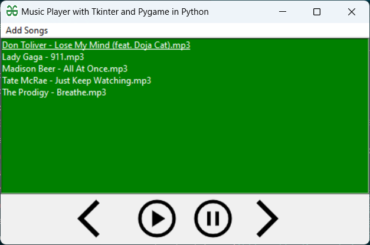
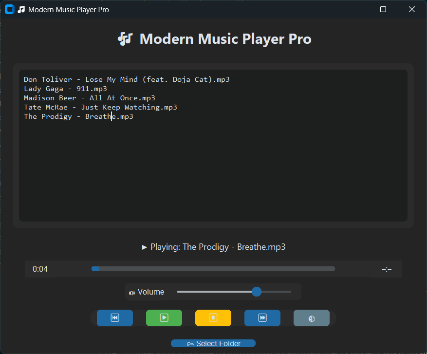
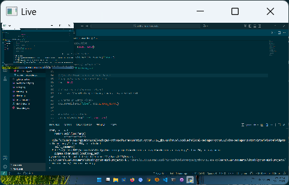
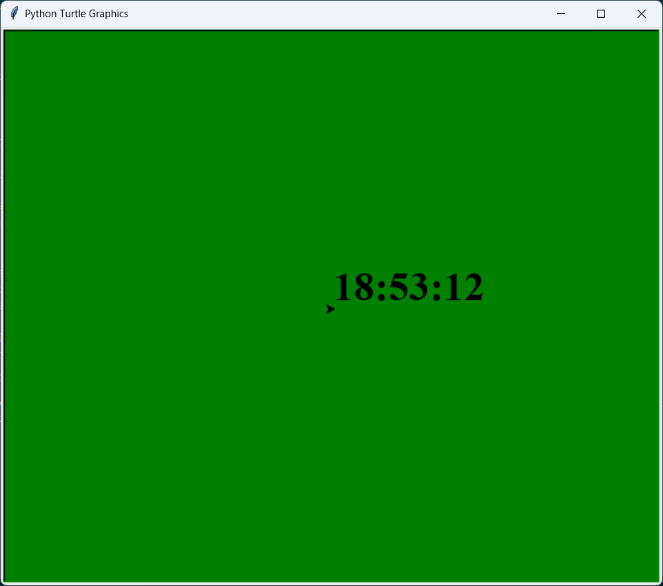

# 🐍 Python Mini Projects

A collection of beginner-to-intermediate Python projects created for learning, experimentation, and portfolio building.  
Each project focuses on core programming concepts — from file handling to GUI development — and is documented for easy reference.

---

## 🎯 About This Repository

This repository contains several small Python applications I built while studying Computer Science and self-learning practical programming.  
Each project started as a learning exercise, then grew into something functional and shareable.

I’m keeping this repo public as a **portfolio of my coding journey** — showing progress from console apps to GUI-based tools.

---

---

## 🖼️ Project Gallery

| Project | Preview | Description |
|----------|----------|-------------|
| **😌 Mood Tracker** |  | Console-based app to log moods, view summaries, and export history to CSV. |
| **🎵 Music Player** |  | Tkinter + Pygame music player with basic controls. |
| **🎧 Modern Music Player Pro** |  | CustomTkinter-based upgraded version with progress bar and volume control. |
| **🎥 Screen Recorder** |  | Records your screen and saves it as a video file using PyAutoGUI + OpenCV. |
| **🕒 Digital Clock** |  | Minimalist Turtle graphics clock showing current time. |

> 🧩 *Each image is stored locally in the `/assets/` folder for easy maintenance.*

---

## 📁 Projects Overview

| Project | Description | Technologies |
|----------|--------------|---------------|
| [🎵 Music Player](./music_player) | Tkinter-based music player built with Pygame, inspired by GeeksforGeeks tutorial. | Tkinter, Pygame, Requests |
| [🎧 Modern Music Player Pro](./modern_music_player) | Upgraded version with CustomTkinter UI, volume control, and theme switcher. | CustomTkinter, Pygame, Mutagen |
| [🎥 Screen Recorder](./screen_recorder) | Simple screen recorder using PyAutoGUI and OpenCV. | PyAutoGUI, OpenCV, NumPy |
| [🕒 Digital Clock](./digital_clock) | A simple clock made with Turtle graphics. | Turtle, Datetime |

---

## 🔗 Linked Repositories (Submodules)

| Project | Description | Version | Repository |
|----------|--------------|----------|-------------|
| 😌 Mood Tracker | Track, view, and edit your moods. Includes CSV export and date filtering. |  | [mood-tracker](https://github.com/Ryuji-Kishima-Fella/mood_tracker.git) |


---

## 🧠 Learning Goals

Through these projects, I’m practicing:
- Writing clean, reusable Python code  
- Managing files, user input, and data storage  
- Creating graphical user interfaces (GUI)  
- Using external libraries (Tkinter, CustomTkinter, Pygame, OpenCV)  
- Version control and project documentation with GitHub  

---

## ⚙️ How to Use

Each folder contains:
- A **Python script (`.py`)**
- A **README.md** explaining features, dependencies, and run instructions

To run any project:
1. Clone the repository:
   ```bash
   git clone https://github.com/<your-username>/python-mini-projects.git
   ```
2. Open the terminal and navigate into the project folder:
   ```bash
   cd mood_tracker
   ```
4. Run the script:
   ```bash
   python mood_tracker.py
   ```

## 🧩 Repository Structure
```yaml
python-mini-projects/
├── mood_tracker/
├── music_player/
├── modern_music_player/
├── screen_recorder/
└── digital_clock/
```

## 🚀 Future Plans
- Build GUI version of Mood Tracker
- Add visualizations (Matplotlib)
- Create a web-based Flask version
- Expand documentation and testing coverage
- Possibly turn selected projects into mini open-source apps

## 📖 License
This repository is open for learning and sharing under the MIT License.
You’re welcome to study, modify, and use the code for educational or personal purposes.

## 🧑‍💻 Author
Ryuji Kishima
```
Undergraduate in Computer Science @ University of the People
Self-learning developer exploring Python, GUI design, and open-source collaboration.
```

GitHub: @Ryuji-Kishima-Fella

