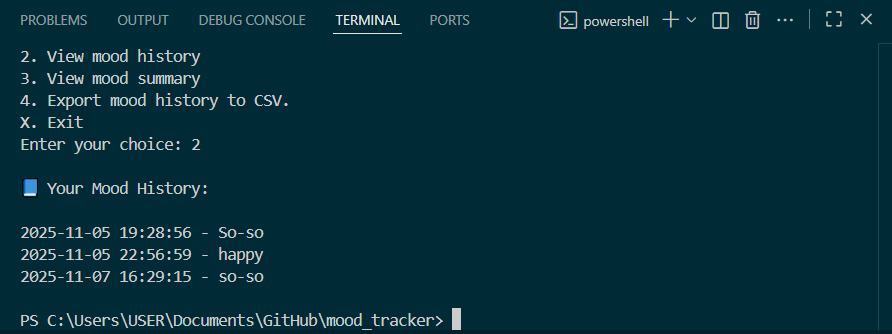

# Mood Tracker (Python)
> Version **1.3.0** — Active Development


A simple Python program that helps you record, view, and analyze your daily moods - created as part of my journey learning Python and GitHub version control.

---

## 🌟 Features

- 📝 **Log your mood** for the day  
- 📖 **View your mood history** (stored in a local text file)  
- 📊 **See a mood summary** showing how often each mood occurs  
- 📤 **Export mood history to CSV** for data analysis (NEW!)  
- 💾 All data saved locally for privacy and simplicity  

---

## About the Project
The Mood Tracker started as a console-based learning project to practice:
- File I/O in Python
- Data storage and retrieval  
- Simple analytics (frequency counts)  
- Version control and GitHub documentation 

It demonstrates progressive skill growth — from basic input/output to structured data handling and CSV exporting.

---

## How to Run
1. Install Python 3.10+
2. Download or clone this repository:
```bash
git clone https://github.com/Ryuji-Kishima-Fella/mood-tracker.git
```
3. Open the terminal and navigate to the mood_tracker folder:
```bash
cd mood_tracker
```

4. Run the program:
```bash
pythoon mood_tracker.py
```

## Menu Options
```yaml
=== Mood Tracker ===
1. Log today's mood
2. View mood history
3. View mood summary
4. Export mood history to CSV
5. Exit
``` 


## Example Output
Mood Summary Example:
```yaml
📊 Mood Summary:
  Happy: 5 times
  Stressed: 2 times
  Tired: 1 time

Most frequent mood: 😌 Happy
```
CSV Export Example:
```csv
Date,Mood
2025-11-05 19:28:56, Happy
2025-11-05 22:56:59, Tired
```

## Future Improvements
- Add charts/graphs
- Add daily reminders
- Turn into a web or mobile app

---

## 🕓 Version History

| Version | Date | Changes |
|----------|------|----------|
| **v1.0.0** | 2025-11-04 | Initial release with basic logging and view history |
| **v1.1.0** | 2025-11-05 | Added mood summary and CSV export features |
| **v1.2.0** | 2025-11-06 | Added view-by-date and delete-last-entry features |
| **v1.3.0** | 2025-11-07 | Added edit entry feature and improved menu structure |

> 💡 Future versions will include GUI (v2.0) and chart visualization (v2.1)

